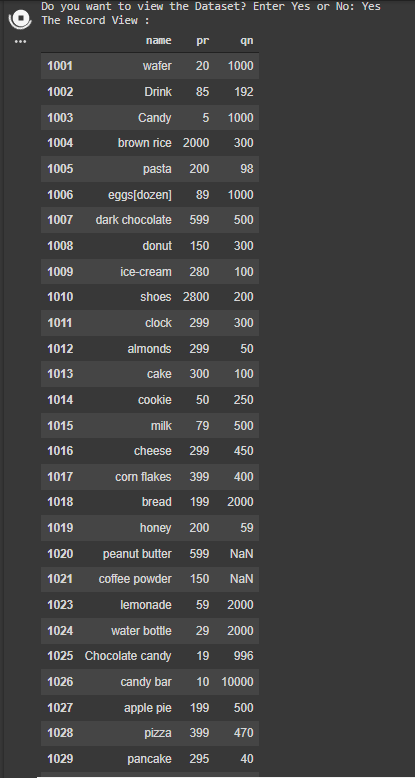

1. Created a Dataset named "record" for the Inventory Management System

2. Converted to JSON format and read from JSON file

3. Created Access for both Admin and Purchaser,

   1. Admin : a) Created Authentication
      b) Adding Multiple products into the Dataset
      c) Deleting Multiple products from Dataset

   

   2. Purchaser : a) Welcoming Purchaser
      b) Displaying the list of products as a Table (using Pandas)

        c) Taken Inputs and Checkout (Selected Product Details and Bill)

4. Updating the quantity of a Product after purchase

   Before Purchase :

   

   After Purchase :

   

5. Creating and appending purchased data to sales.json file

